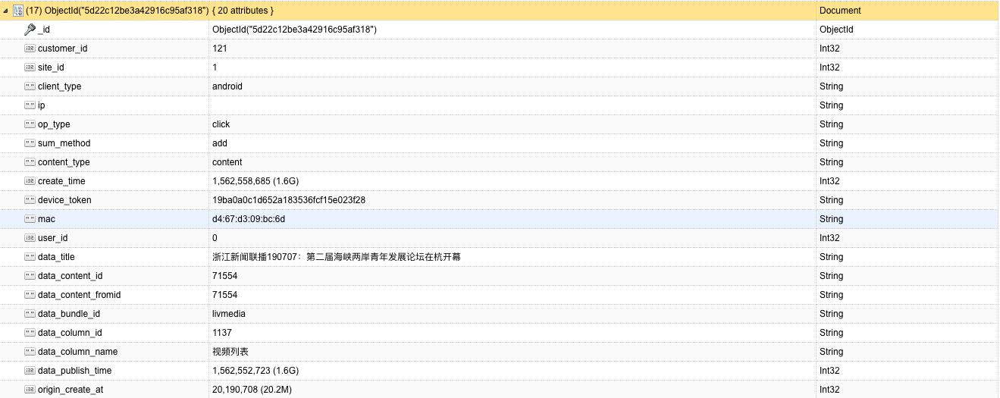
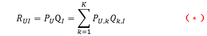
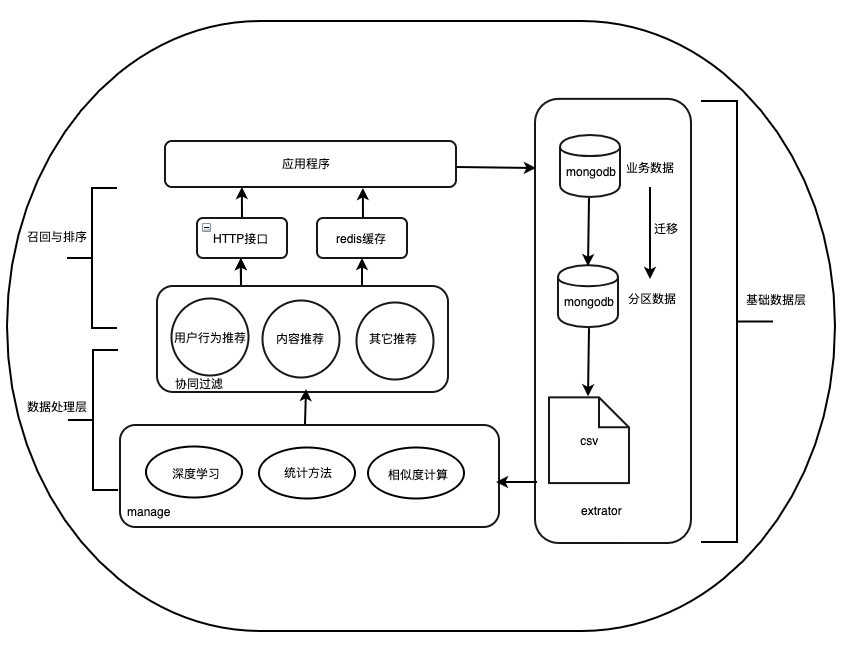

<center><font size="6"> 推荐系统</font></center>
--
<center>

|文档版本号|日期|备注|
| :---: | :---: | :---: | :---: | :---: |
|1.0.0|2019.09.16|创建文档|
|1.0.1|2019.10.08|添加内部算法原理,核对文档内容|
|1.1.0|2019.10.09|修改系统初始化逻辑|
|1.2.0|2019.10.10|增加推荐结果的redis缓存,实现客户端并发访问|
|1.3.0|2019.10.12|增加用户浏览文章历史记录,并将保存的文章信息和用户信息存储至mongodb中|

</center>
--

一. 推荐系统需求与现状
--

&#160; &#160; &#160; &#160;随着⽹络技术的飞速发展，互联⽹上存储了海量的数据。在⾯对如此数量的数据，需要智能化选择出想要的信息，搜索引擎和推荐引擎都是为此⽽⽣。用户在浏览新闻时，有时候自己都无法明确一个确定的目标，这个时候需要计算机帮助用户推荐当下热点或者随机选择用户感兴趣的内容，以此带来软件的增值服务。目前公司mongodb数据库存储原始的用户行为数据（见下表），可以利用智能推荐算法，对数据进行二次开发，这样可以合理地高效地将统计结果呈现给用户。



二. 推荐系统算法原理
--

#### 1.协同过滤
&#160; &#160; &#160; &#160;协同过滤（Collaborative Filtering）,从通俗的解释就是在具有相互关联同伴的帮助下过滤筛选，即一般是在海量的用户中发现一小部分和你品味比较相近的，在协同过滤中，这些用户称为邻居，然后根据他们喜欢的东西组织成一个排序的目录来推荐给你。问题的焦点就是怎样去寻找和你比较相似的用户，怎么将那些共同的喜好组织成一个排序的目录推荐给你，要实现一个协同过滤的系统，需要以下几个步骤：

  1. 收集用户的爱好,并将原始业务数据量化
  2. 根据量化的数据,关联其它物品的喜好程度
  3. 根据计算结果,找到相似的用户或者物品


&#160; &#160; &#160; &#160;在收集用户的喜欢方面，一般的方式有评分，投票，转发，保存书签，点击连接等等 ，有了用户的喜好之后，就可以通过这些共同的喜好来计算用户之间的相似度了,一般分为三种方法:

1. 基于用户的协同过滤：不考虑用户、物品的属性（特征）信息，它主要是根据用户对物品的偏好（Preference）信息，发掘不同用户之间口味（Taste）的相似性，使用这种用户相似性来进行个性化推荐。基于用户的协同过滤推荐，它是以用户为中心，观察与该用户兴趣相似的一个用户的群体，将这个兴趣相似的用户群体所感兴趣的其他物品，推荐给该用户。

2. 基于物品的协同过滤：也不考虑用户、物品的属性（特征）信息，它也是根据用户对物品的偏好（Preference）信息，发掘不同物品之间的相似性。基于物品的协同过滤推荐，是以物品为中心，通过观察用户对物品的偏好行为，将相似的物品计算出来，可以认为这些相似的物品属于特定的一组类别，然后根据某个用户的历史兴趣计算其所属的类别，然后看该类别是否属于这些成组类别中的一个，最后将属于成组类别所对应的物品推荐给该用户。

3. 基于模型的协同过滤：基于模型的协同过滤推荐，是采用深度学习的方法，通过离线计算实现推荐的，通常它会首先根据历史数据，将数据集分成训练集和测试集两个数据集，使用训练集进行训练生成推荐模型，然后将推荐模型应用到测试集上，评估模型的优劣，如果模型到达实际所需要的精度，最后可以使用训练得到的推荐模型进行推荐（预测）。可见，这种方法使用离线的历史数据，进行模型训练和评估，需要耗费较长的时间，依赖于实际的数据集规模、深度学习算法计算复杂度。对于我们的用户历史行为数据，我们关注的是用户与物品之间的关系，可以生成一个用户-物品矩阵，矩阵元素表示用户对物品的偏好行为（或者是评分），如果用户和物品的数量都很大，那么可见这是一个超大稀疏矩阵，因为并不是每用户都对所有的物品感兴趣，只有每个用户感兴趣的物品才会有存在对应的偏好值，没有感兴趣的都为空缺值，最终我们是要从这些空缺值对应的物品中选择出一些用户可能会感兴趣的，推荐给用户，这样才能实现个性化推荐。我们假设使用用户-物品的评分矩阵来实现推荐，定义评分矩阵为R，那么通过将R分解为另外两个低秩矩阵U和M，由于R是稀疏矩阵，很多位置没有值，只能通过计算使用U与M的乘积近似矩阵R，那么只要最终得到的误差尽量小，能满足实际需要即可，一般选择不同的损失函数来衡量，那么就要计算目标函数的最小值,
  
#### 2. LFM(Latent Factorization Model)
&#160; &#160; &#160; &#160;对于一个给定的用户行为数据集（数据集包含的是所有的user, 所有的item，以及每个user有过行为的item列表），使用LFM对其建模，R矩阵是user-item矩阵，矩阵值Rij表示的是user i 对item j的兴趣度，这正是我们要求的值。对于一个user来说，当计算出他对所有item的兴趣度后，就可以进行排序并作出推荐。LFM算法从数据集中抽取出若干主题，作为user和item之间连接的桥梁，将R矩阵表示为P矩阵和Q矩阵相乘。其中P矩阵是user-class矩阵，矩阵值Pij表示的是user i对class j的兴趣度；Q矩阵式class-item矩阵，矩阵值Qij表示的是item j在class i中的权重，权重越高越能作为该类的代表,所以LFM根据如下公式来计算用户U对物品I的兴趣度.





&#160; &#160; &#160; &#160;使用LFM后， 我们不需要关心分类的角度，结果都是基于用户行为统计自动聚类的，全凭数据自己说了算。不需要关心分类粒度的问题，通过设置LFM的最终分类数就可控制粒度，分类数越大，粒度约细。对于一个item，并不是明确的划分到某一类，而是计算其属于每一类的概率，是一种标准的软分类。对于一个user，我们可以得到他对于每一类的兴趣度，而不是只关心可见列表中的那几个类。对于每一个class，我们可以得到类中每个item的权重，越能代表这个类的item，权重越高。
计算矩阵P和矩阵Q中参数值。一般做法就是最优化损失函数来求参数。user-item集K={(U,I)}, 其中如果(U,I)是正样本，则RUI=1，否则RUI=0。

&#160; &#160; &#160; &#160;数据集问题：正负样本平衡。数据集应该包含所有的user和他们有过行为的（也就是喜欢）的item。所有的这些item构成了一个item全集。对于每个user来说，我们把他有过行为的item称为正样本，规定兴趣度RUI=1，此外我们还需要从item全集中随机抽样，选取与正样本数量相当的样本作为负样本，规定兴趣度为RUI=0。

#### 3.架构与业务流

 - 用户行为数据搜集,业务数据搜集
 - 批量计算,构建用户画像
 - 用户结果召回,排序精选
 - 实时推荐业务流的搭建

基础数据层:

 * 包括业务数据和用户行为数据
 	* 业务数据包含用户数据和文章数据,用户数据即在公司app上注册用户的基础数据和使用app的未注册用户数据,文章数据在媒体平台上的新闻数据
 	* 用户行为日志源于前端埋点

数据处理层:

* 基础计算:基于离线和实时数据,对基础数据计算用户画像、文章标题画像
* 召回与排序:召回根据不同的算法从文章库选择用户感兴趣的文章id候选集合;排序则对各类候选集合的文章id相对于用户,生成一个有序列表.

推荐业务层:

 * 通过对外接口或者或者用户缓存队列实现推荐业务接入
 	* Feed流推荐:用户可以在这些页面中不断下拉刷新

三. 推荐系统接口简介
--

- 基于对新闻的点击数统计和分布的方法的推荐算法

&#160; &#160; &#160; &#160;该方法对某个customer_id下的用户(包含登陆和未登录)进行词频统计，热点新闻的用户点击量一般较高，另外考虑点击新闻的用户分布，分布越广，用户一般越感兴趣，因此利用改进的tfidf算法进行新闻推荐，该方法一般用于对未登录用户进行推荐，用于解决推荐系统冷启动问题。

- 基于用户行为的推荐算法

&#160; &#160; &#160; &#160;该方法主要对登录用户进行关联推荐，当我们要想知道⽤户对什么物品感兴趣时，我们可以找到与他有相似兴趣的其他⽤户，然后将他们感兴趣的内容推荐给此⽤户。底层使用深度学习方法进行计算，根据customer_id下所有登录用户数据，在后台不断计算模型，并保存模型，在使用时加载模型即可。迭代时长等参数，使用配置文件进行动态控制

- 基于新闻内容的推荐算法

&#160; &#160; &#160; &#160;目前mongodb存储新闻的标题，而没有具体新闻内容，底层实现是根据标题属性实现。基于内容的推荐算法更依赖新闻本身信息。它会分析用户历史检索频率高的新闻，检索相似新闻，然后推荐给⽤户。如一个喜欢看球赛的用户，会检索到比赛相关的新闻，该算法主要使用词向量相似度计算方法。

四. 推荐系统流程图
--



五. 推荐系统接口
--
###4.1 用户行为推荐接口
####请求报文	
```
[POST] http://ip:port/UserBased
```
- customer_id

|参数|类型|是否必须|描述|默认值|
| :---: | :---: | :---: | :---: | :---: |
|customer_id|string|是|客户所在域标识符|无|
- user_id

|参数|类型|是否必须|描述|默认值|
| :---: | :---: | :---: | :---: | :---: |
|user_id|string|是|登录用户id|无|

- top_k

|参数|类型|是否必须|描述|默认值|
| :---: | :---: | :---: | :---: | :---: |
|top_k|string|否|推荐选择前top_k个文章data\_content\_id|1000|

####请求报文体示例(JSON)
```
{
	"customer_id":"83",
	"user_id":"579729",
	"top_k":"3"
}
```

####返回结果示例
```
{
    "customer_id": "123",
    "data": [
        "21752",
        "338160",
        "94",
            ],
    "result": "success",
    "top_k": 3,
    "user_id": "100088"
}
```

###4.2 内容相似度推荐接口
####请求报文

```
[POST] http://ip:port/ContentBased
```
请求报文参数和返回值同上

###4.3 点击率统计的推荐接口
####请求接口和参数	
```
[POST] http://ip:port/coldstart
```
- customer_id

|参数|类型|是否必须|描述|默认值|
| :---: | :---: | :---: | :---: | :---: |
|customer_id|string|是|客户所在域标识符|无|

- top_k

|参数|类型|是否必须|描述|默认值|
| :---: | :---: | :---: | :---: | :---: |
|top_k|int|是|推荐选择前top_k个文章data\_content\_id|无|

####请求报文体示例(JSON)
```
{
	"customer_id":"123",
	"top_k":100
}
```

####返回结果示例
```
{
    "customer_id": "123",
    "data": [
        "21752",
        "338160",
        "94",
        ...
            ],
    "result": "success",
    "top_k": 100,
    "user_id": "100088"
}
```

### 4.4 并发缓存
1. 缓存数据库名见Config.ini中Redis配置项db
2. 新文章缓存
	- 缓存名称: `客户id` + `_` + `customer_id`,如```83_customer_id```
	- 缓存值: 按文章新旧程度排序后的 `data_content_id`值
3. userCF缓存
	- 缓存名称: `data_content_id` + `_` + `客户id` + `_` + `用户id`,如```data_content_id_83_12332```
	- 缓存值: 基于用户点击率协同过滤后的`data_content_id`值
4. item相似度缓存
	- 缓存名称: `content_based` + `_` + `客户id` + `_` + `用户id`,如```content_based_83_12332```
	- 缓存值: 基于文章标题内容相似度计算后的 `data_content_id`值
	
六. 面临的问题、挑战和规划
---

- 业务数据中含有大量未登录用户的点击行为,某个customer_id下业务数据经过过滤,剩下针对注册用户个性化推荐的业务数据较少,影响用户体验.

- 业务数据中包含的能够针对用户进行画像的有效埋点较少,只有新闻标题、点击记录产生时间和点击行为等少数信息可以作为分析依据,影响推荐系统效果.

- 最大限度挖掘数据中的信息,并组织有效信息呈现客户,对性能与效果进行更细致的跟踪和优化.